{: .label }
Leon Terencio Otte, Ayten Teshome

{: .no_toc }
# Reference documentation

<!-- 

{: .text-delta }

Table of contents

+ ToC
{: toc }

 -->

---

## Route References:

--- Home 

**Route:** `/`
**Route:** `/home`

**Methods:** `GET`

**Purpose:** Weiterleitung auf Home Page

**Sample output:** 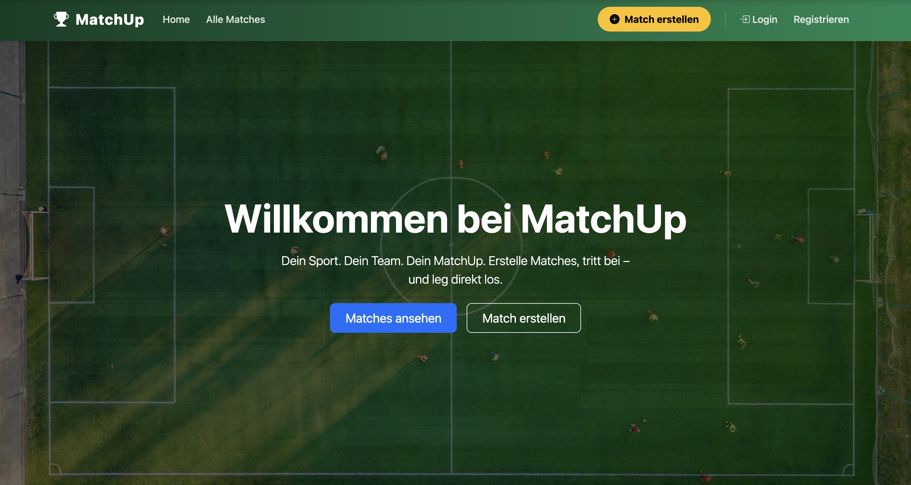

Browser shows: `Browser zeigt das Template `home.html` welches als Einstieg für MatchUP UI dient.`

--- Authentifizieren

**Route:** `/register`

**Methods:** `GET`, `POST`

**Purpose:** Regestrierungsformular anzeigen, Regestrierungsdaten verarbeiten & neuen User anlegen

**Sample output:** 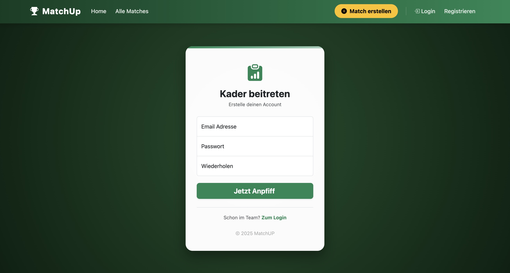
--

**Route:** `/login`

**Methods:** `GET`, `POST`

**Purpose:** Login-Formular anzeigen, Login Daten prüfen & Session setzen

**Sample output:** 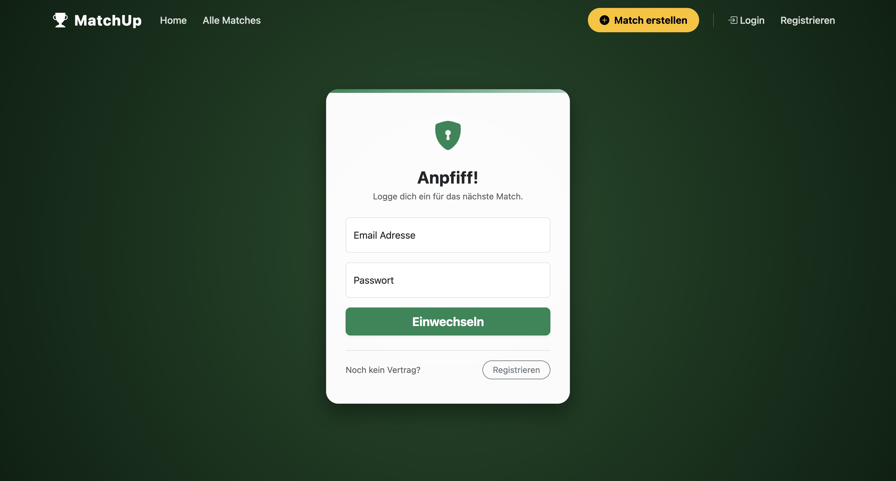

--- Match Management

**Route:** `/allmatches`

**Methods:** `GET`

**Purpose:** Anzeige einer Übersicht aller Matches

**Sample output:** 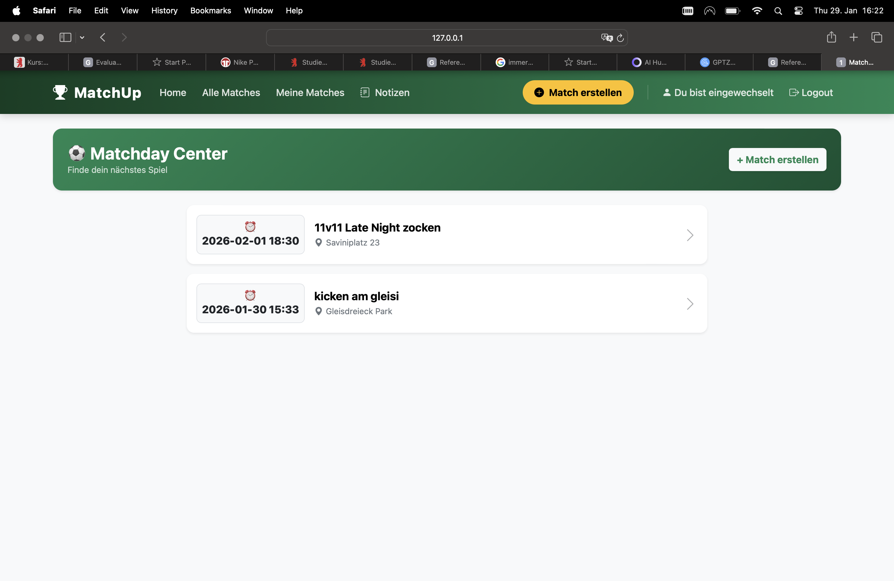

-- Match Detail

**Route:** `/match_detail/<int:match_id>`

**Methods:** `GET`

**Purpose:** Anzeige der Detailinformation zu einem einzelnen Match. In finalen Version soll hier dann auch ein Match beigetreten, verlassen oder gelöscht werden. 

**Sample output:** 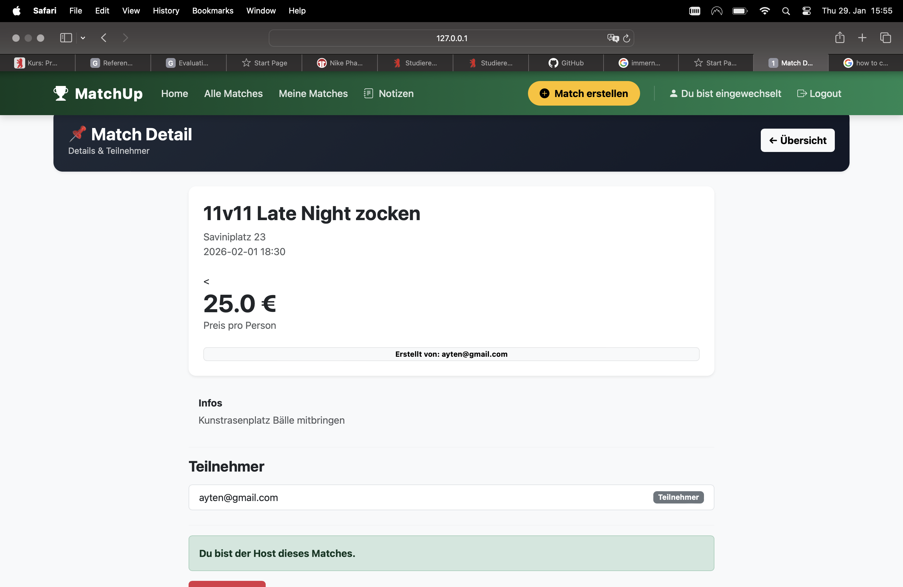

--Create Matches

Browser zeigt das Template `allmatches.html` mit einer Liste von Matches 

**Route:** `/matches/create`

**Methods:** `GET`, `POST`

**Purpose:** Erstellen eines neuen Matches durch den eingeloggten User. Anzeige eines Formulates zum Erstellen eines Matches und Speichern der Formulardaten in die Datenbank.

**Sample output:** 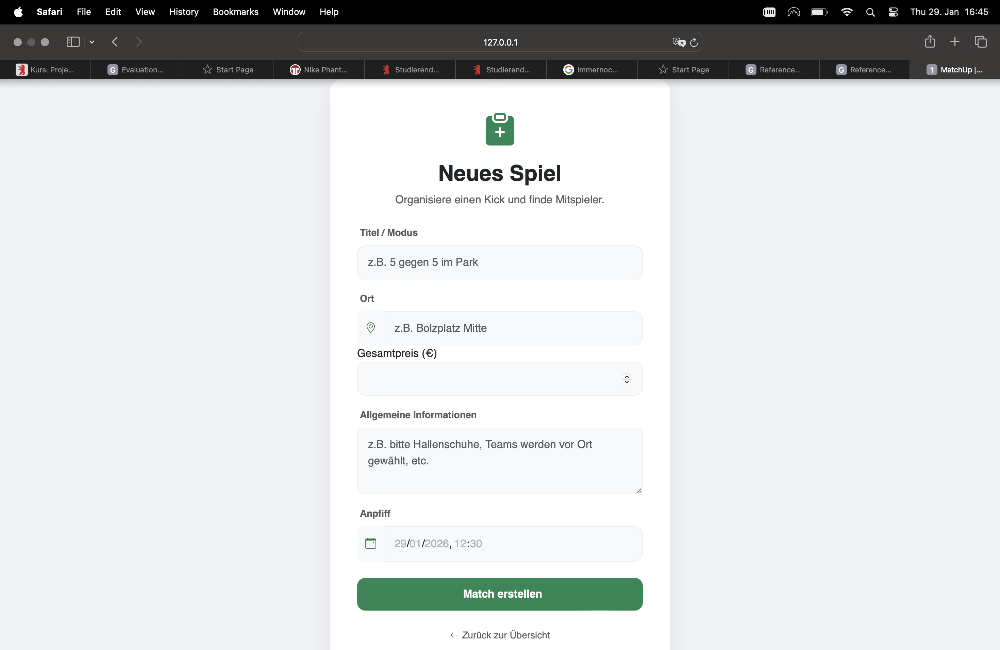
-- My Matches

**Route:** `/my-matches`

**Methods:** `GET`

**Purpose:** Anzeige aller Matches des von den User erstellten und den Matches, welchen er beigetreten ist.

**Sample output:** 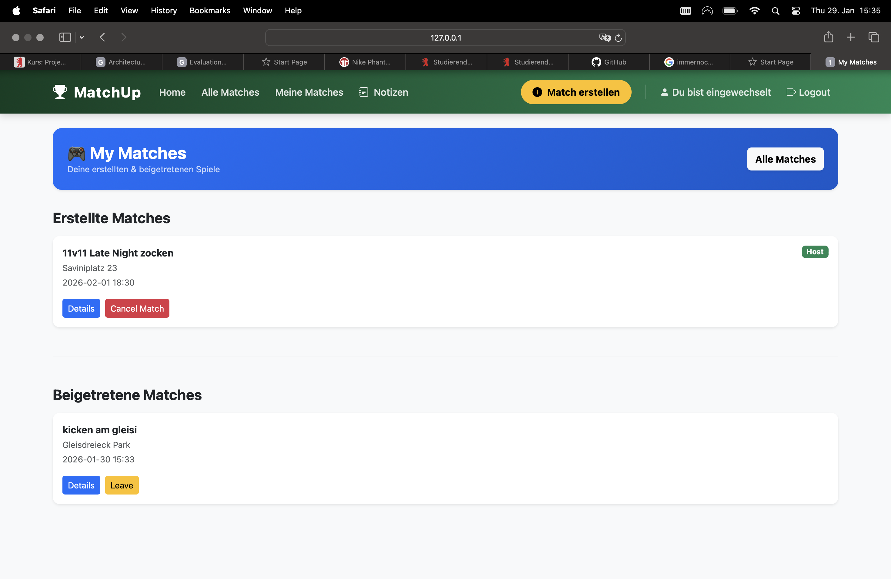
-- Join Matches

**Route:** `/matches/<int:match_id>/join`

**Methods:** `POST`

**Purpose:** Fügt den aktuell eingeloggten User als Teilnehmer zu einem Match dazu. 

**Sample output:** 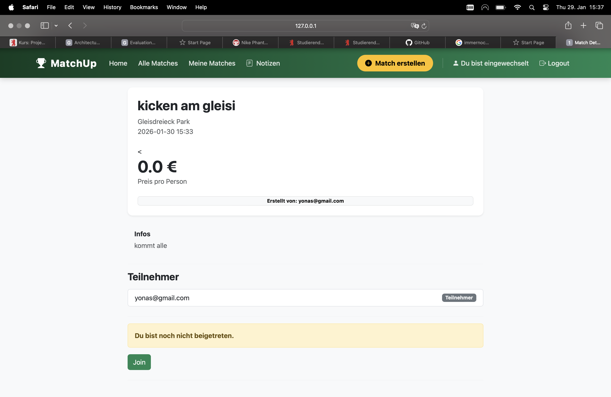
-- Leave Matches

**Route:** `/matches/<int:match_id>/leave`

**Methods:** `POST`

**Purpose:** Entfernt den aktuell eingeloggten aus der Teilnehmerliste von dem Match.

**Sample output:** 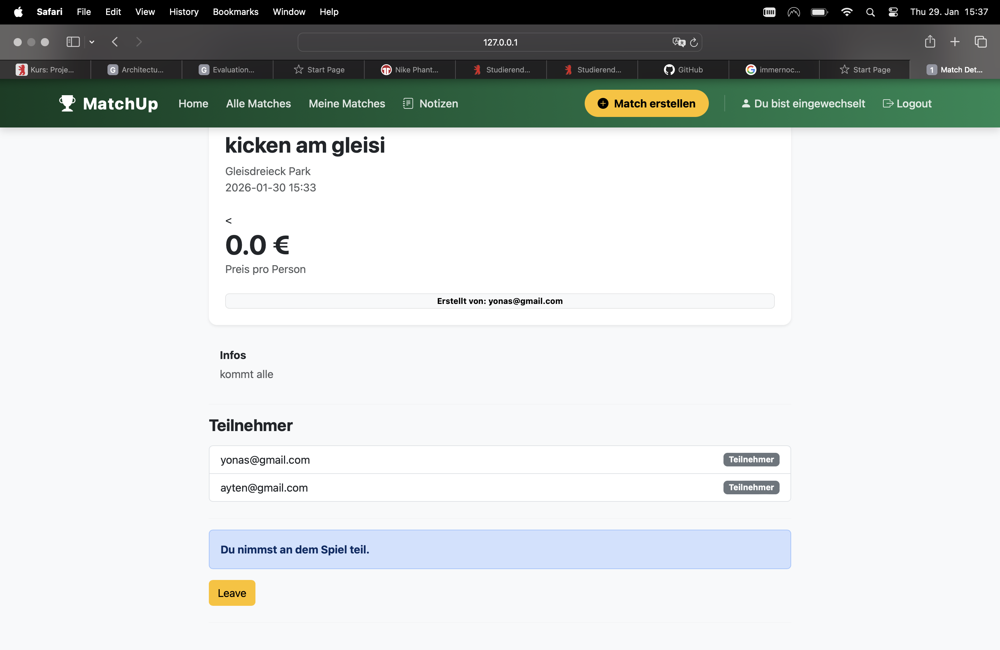
-- Cancel Match

**Route:** `/matches/<int:match_id>/delete`

**Methods:** `POST`

**Purpose:** Löscht das Match aus der gesamten Datenbank. Nur der Host des Matches soll dazu berechtigt sein

**Sample output:** 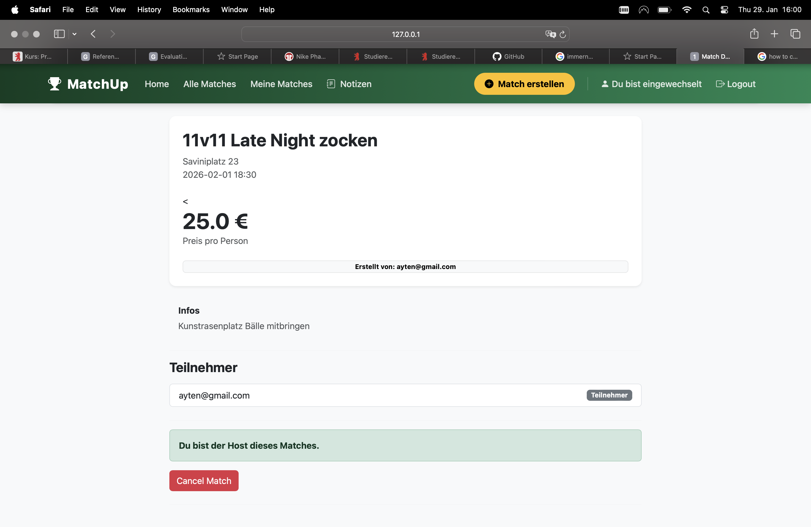
-- Notes

**Route:** `/note`

**Methods:** `GET,POST`

**Purpose:** Ermöglicht es dem User Notizen zu erstellen, anzusehen und speichern.

**Sample output:** 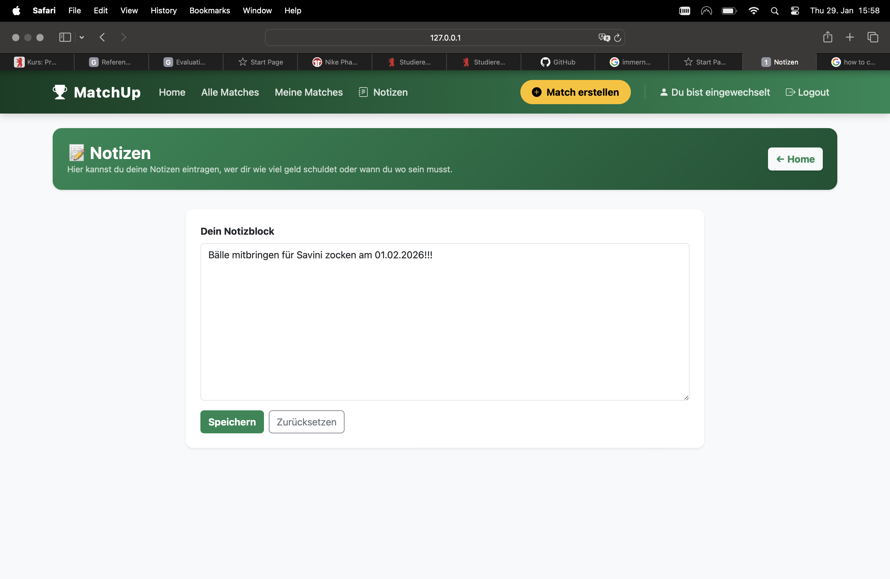
--